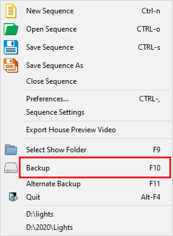

# Backup and Recovery

## Backup

Backing up your critical files and sequences should be done regularly – as good practice.

What should be backed up ? Anything you require to run your show, but in particular your XML sequences, your media files and your user specific xLights configuration files.

The xLights configuration files are located in your show directory and are: xlights\_keybindings.xml, xlights\_networks.xml and xlights\_rgbeffects.xml


By default xlights backs up the key files at the start of a session when xLights is launched.


The files are saved in a subfolder with a timestamp and ‘\_onstart’ suffix.

It will also create a backup when the show directory is changed. If you have enabled Backup on Save, it will also take a snapshot after every Save operation.


Pressing F10 anytime, anywhere will backup your XML files for you and store them in a new folder with the date/time embedded in the name the backup was created. You can press F10 as many times as you like and should do this at least once per sequencing session. Keep in mind that you must have saved at least once in order for an updated XML file to be protected.


Alternatively, from the File menu, select Backup.

You will be presented will a message indicating where a backup will be created. Click Yes to proceed.  
Every time this step is executed, a copy will be created of all the ‘\*xml’ files from your show directory into the Backup subdirectory of your show directory. A new subfolder is created each time a backup is executed.


The F11 function does not do an auto \(in memory\) backup of the current sequence if you have one open. It will backup the open sequence XML contents from when it was last saved.



It is a good practice to also separately backup any files that you may have used as inputs to your sequences such as LSP, LOR, Papagayo files that you imported, media files that may have amended with audacity, GIF or JPEGs etc. You may also wish to backup any FSEQ files, though this can be recreated by saving the sequence again.


Backing up the show directory \(and media directory if it is different\) to an alternate location is the simplest way to ensure that you have the files required.

## Recovery

To summarise the backup functionality:

* When xlIghts starts up - a folder timestamp\_OnStart is created and the XML and XBKP files in the show directory are backed up there.
* When F10 / F11  is pressed , a folder \(timestamp\) is created  in the show/alt location and the above files are backed up there \(referred to as an on demand save\).
* Every x \(3,10,15,30\) minutes , the current open XML file \(i.e xxx.xml\) is backed up \(overwrite\) to xxx.xbkp or \_\_.xbkp \(for a new unnamed sequence\) in the show directory. This will occur if there have been any changes since the last auto save or on demand \(F10/F11\) save.
* Every x minutes \(same value as set above\), the xlights\_rgbeffects.xml is backed up to xlights\_rgbeffects.xbkp in the show directory. This includes the layout as well.  This will occur if there have been any changes since the last auto save or on demand \(F10/F11\) save.

If you need to recover:

If you want to restore the XML you were working on , then \(Shut down xLights first and then\)

* Rename existing xxx.xml to say xxx\_old.xml, and rename xxx.xbkp to xxx.xml. For a new unsaved sequence , just rename \_\_.xbkp to xxx.xml. Render All and Save.
* If this does not work as required , then look for the latest backup timestamp created using F10 , F11 or in the 'timestamp\_OnStart folder' and replace the XML as above.
* If that does not work, then go to the next oldest backup by timestamp etc


If you have changed show directories then also look in the show directory you were working in for backups created there. When you change show directories the onStartup backup will also be created for the new show directory … ensuring you always have a start of session backup.


If you need to restore the xlights files, then

* Rename existing xlights\_rgbeffects .xml to say xlights\_rgbeffects\_old.xml, and rename xlights\_rgbeffects.xbkp to xml to xlights\_rgbeffects.xml from your show directory.
* If this does not work as required , then look for the latest backup timestamp created using F10 , F11 or in the 'timestamp\_OnStart folder' and replace the xlights\_rgbeffects. xml as above.
* If that does not work, then go to the next oldest backup by timestamp etc

If you have recently changed your network definition and you need to recover that , then look for the xlights\_network.xml file in the most recent timestamped folder and copy and replace the current one \(after renaming the current one\).

