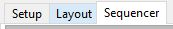

# Sequencer

## Sequencer

The sequencer is where the majority of time will be spent and where most of the functionality that the user sees resides.  The main areas and functions of the Sequence tab are as follows:

