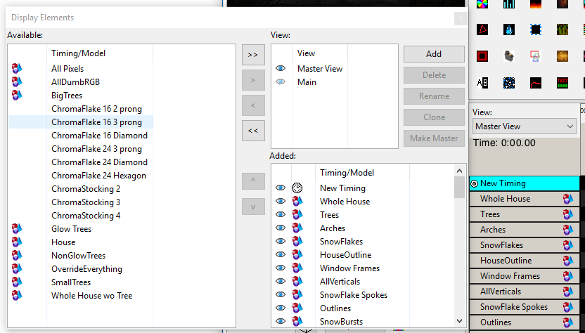

# Views

## Views

A view is used to be able to easily select a list of models and the sequence in which they are to be displayed on the sequencer.

Views work across sequences, so once you have setup a view with the models that you require, if you open any sequence, that view is available to use in that sequence.


If you define Model Groups in a view, then when you use the view in the sequencer, you will be presented with a list of the groups. Double Clicking each group will open up the list of models within the group.


Multiple views can be defined, with each view defining a list of models that are to be displayed and the sequence that they should be displayed in.  For example:

* A ‘Static Model’ view may contain all elements that are non RGB.
* An ‘Import Model’ view may contain only elements that you wish to sequence after importing other data from other sequencers.
* A ‘Halloween Model’ view may contain only elements that you wish to sequence for Halloween.

To Create a new View , click on the Add button, enter a unique name in the window and Click OK.

To delete an existing view , highlight the view from the View window and select Delete.

New models can be added to a view by first selecting that view from the Views list on the right, then second select the Available Model on the Left and third clicking on Right Arrow Button.

Similarly models can be removed from a View by highlighting the model in the Model window on the right and clicking on Left Arrow Button..

The position that the model appears within the view can be changed by highlighting the model and clicking on Up or Down Arrow.

The Double Left and Right Arrows will Add or Remove All the Models in either list.

Within each view, the models that are part of the view can be marked as visible or non visible via the button to the left of the model.


The visibility is across all sequences and not specific to the sequence that is open.  So if you make a model non visible, it will become non visible in all sequences.


The Master View is a special \(system created\) view.  It contains all the models that have been defined for the sequence that is open only i.e. it does not span sequences.  It also determines the rendering order. Any model added to any other view when a sequence is open automatically gets reflected in the Master View of that sequence.  Models can be deleted \(i.e. removed\) from any view at any time.


If you attempt to delete a model from the Master View, you will be prompted to confirm the deletion, as deleting the model from the Master View will remove all effects that you have created against that model for the sequence that you have open.


If you add a Timing Track to a view, it will be added to all views that you have defined.

