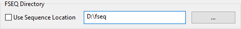

# Directories

## **Show** Directory

The xLights Show Directory is where all the required xLights sequences, pictures, and user configuration files required to run the sequences are kept. When a sequence \(.xml\) is saved and a binary file \(.fseq\) rendered, both files are created in the show directory. This is the same location where xLights configuration files can be found and the default location where the program will first prompt for, or look for files pertaining to several functions of xLights.

Specifying or changing the location of the Show directories can be done by clicking on the Change button found on the Setup tab screen.


It is useful to have separate show directories for each major event i.e. one for Halloween, one for Christmas or one for the next year. Start a new year directory by copying sequences from the Show Directory of the previous year.



Keep the folder name, containing the 'xlights\_rgbeffects.xml' file the same when creating a new show folder. Create the new folders in the lower level directory and xlights will automatic adjust file paths. As an example, use "2018/Christmas" then "2019/Christmas" \(the last sub folder folder is the same\) instead of "Christmas/2018" and "Christmas/2019".



Images used for pictures and faces use an absolute location reference. If you are not using the suggested structure, then the location won’t be found if you change your show directory.


In some cases if you copy your show directory to another location or drive xLights may still be able to successfully locate image files despite the absolute reference \(in the case where the the last sub folder of the location has the same name\).

If you have a show folder c:\show and you move it to e:\xxx\yyy\show it will seamlessly work as long as all the files your sequence needs are in the show folder or one of its subdirectories. Anything located elsewhere will not be seamlessly moved but if they are still there they will be used.


This is useful if you are moving your setup to a USB drive or Dropbox. If however you move it to c:\show\_old and try to set that as the show directory, then the files won't be referenced.


## Subfolders

The Subfolders Dialog allows certain files to be stored in other folder locations, outside the show folder, on the harddrive. This is useful if you want to keep you show folder in Dropbox or Google Drive, but do not want to sync larges files like the fseq files and backups.

### **Media Directory**

The Media Directory is where the required audio \(.mp3 or mp4\) and video \(.mp4\) media files are kept. If the Use Show Folder Checkbox is Selected the Show Directory will be used. The media directory can be different to the show directory or but it defaults to the show directory. This is the default location where xLights will first prompt for, or look for media files when creating a new musical sequence. The user can however, browse to and select a media file from another location. After which, the media location and name is as specified, and is saved in the sequence xml file. If while opening the sequence, the media file cannot be located as specified in the sequence xml, xLights will look for a file of the same name and type in the media directory.


Users often have a common media directory for all shows. However, a more common practice is to place all of the media for a particular show event in the show directory and set both of them to be the same. It makes it much easier to back it up, copy it between computers etc.


### FSEQ **Directory**

This is the location where the Sequence FSEQ's will be saved. If the Use Sequence Location Checkbox is selected \(the default\) the FSEQ files will be saved in the same folder as the sequence .xml file location. If this is unchecked and a folder path is specified all the FSEQ will be saved to that location. If this folder doesn't exist \(move computers or remove a harddrive\) the FSEQ directory will default back to the show directory.

### **Render Cache** **Directory**

This is the location where the Render Cache directory data will be saved. If the Use Sequence Location Checkbox is selected \(the default\) the Render Cache directory will be saved in the same folder as the sequence .xml file location. If this is unchecked and a folder path is specified all the Render Cache data will be saved to that location. If this folder doesn't exist \(move computers or remove a harddrive\) the Render Cache directory will default back to the show directory.

### **Backup Folder**

This is the location where the backup folder\(Backup on Save/Launch or F10\) will be saved. If the Use How Folder Checkbox is selected \(the default\) the backup files will be saved in the show folder. If this is unchecked and a folder path is specified all the backup files will be saved to that location. If this folder doesn't exist \(move computers or remove a harddrive\) the backup directory will default back to the show directory.

### **Alternative Backup Folder**

This is the location where the Alternative backup folder\(F11\) will be saved. This Backup function is intended as a secondary backup location, like a external hardrive or NAS device. By default the location is not set to anything and will prompt you if you attempt to do a Alternative Backup and no folder is set. To enable select the Enable checkbox and set the desired folder or drive location.

