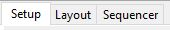

# Set Up

## **Setup**

The Setup tab is used to define the locations of the Show directory, Sub Folders, as well as to configure the details of your network for each Universe. 


If the Save Button is Red, There are unsaved changes.


