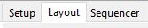

# Layout

## Layout

The layout tab displays a full preview of your show and provides a view of how all the models will appear. In addition you can :

* Define new Models or change existing Model definitions.
* Define new Model Groups or change existing Model Group definitions.
* Select which Models, or Model Groups are be displayed on the Layout.
* Select and adjust the layout background.
* Specify, position and adjust the model size , orientation and location on the layout.
* Check whether any models have overlapping channels.
* Review or change the detailed characteristics of a model’s attributes
* Create Additional Preview layout windows
* Assign Models to one or more  Preview Layouts

