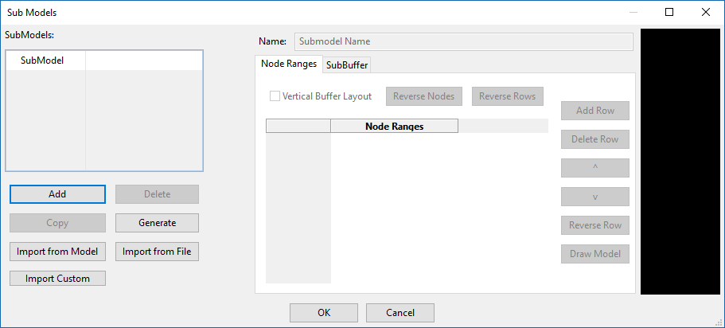
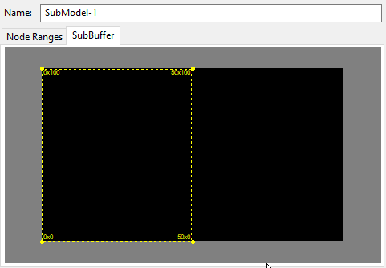
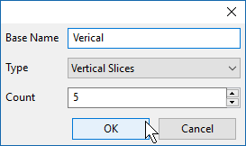

# SubModels

## Node Range SubModels

This setting allows the user to specify parts of a model to be controlled as if it were its own model. For example, you could defined the horizontal and vertical section of a windows frame.

Click Add to create a new submodel. Then add the nodes that will be included in the submodel. On the right side you will see the model and selected nodes will be highlighted.

On the right side, the model will be displayed with the selected nodes highlighted. If the user clicks the row header\(Top or Bottom\), the display will highlight only the nodes in the selected row. If the user clicks the "Node Ranges" column header, all the nodes from all the rows will be highlighted.

The Node Ranges 'Grid' represents the submodels render buffer. A grid five row high with four node listed per row will create a 5x5 Render buffer. Empty Commas\(,\) can be used to create empty spaces in the render buffer. The example below will create 5x5 a outline with a 3x3 'hole' in the middle.


Always Press 'Tab' after changing the submodel name or adding nodes to a row. This will guarantee the changes will "stick" and not disappear.


To graphically select the nodes, double click the row header or row cell and select the desired nodes. This option will only populate one row at a time.

The 'Vertical Buffer Layout' checkbox with rotate the underlining render buffer 90 degrees.

## Draw Model

To Draw a model, like a Cross, across the whole model click the Draw Model Button.

Click and drag to select nodes\(blue highlight\). The selected node will turn grey once selected. Double clicking on a node number also toggles between selected and not selected. 'Select All' will select all the nodes. 'Select None' will deselect all the nodes.

The "From Model" button allows the user to select nodes based on the custom model "shape". For Example, you can import a snowflake model file to overlay it on a matrix.

Hold the 'Ctrl'/'Cmd' Key highlight the cells and press Ctrl+C to copy them. Ctrl+V can then be used to paste the cells. This data can also be copied to and from Excel.

Click Ok to Close the select window.

## SubBuffer SubModel

The SubBuffer tab allows the user to select sections of the buffer instead of the nodes. This can be used to divide mega trees/matrices into slices for singing face or individual effects.

Click The Generate Button to automatically generate different size slices.

Vertical Slices will create 'count' number of vertical slices that are equal size.

## Delete

Delete the currently selected submodel\(s\).


To select multiple submodel to delete, hold the shirt or ctrl/command key.


## Copy

Copy the currently selected submodel.

## Import from Model

This allows the user to 'copy' submodels from another similar model. Example, if multiple mini-trees, are defined in your layout, only create the sub-models on one tree and then use this option to import the sub-models on all the other trees.

## Import from File

This allows the user to 'copy' submodels from a XModel file.

## Import Custom

This option will use a custom model and submodels X/Y node location and create a submodels from the node locations.

