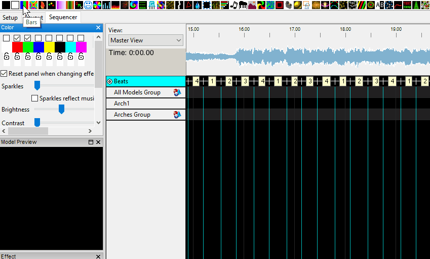

# Adding Effects

### Adding Effects

You can then drop and effect against either the Model Group or the Model. Model groups are identified by a small group icon after the name. 

If you double Click on the  Model Group name, it will expand and show you the models that have been defined as part of the Model group - in this case the ‘Arch 1’ model. Double Click again to collapse the Model Group.

### Adding Effects Against a Model

First Select a Timing marks you like to use. To do this, select the circle next to timing track. Int the example The ‘Beats’ timing marks are selected.

Select an effect \(in this case the Bars effect\) and drag it onto the grid in line with the ‘Arch 1’ model.

This is effectively placing the effect against the model.  

You could also place it against the Model Group - \(one line higher\), in which case it applies to all models under the Group.

You can grab the edge \(in purple\) and drag it to the right to stretch.  Note that the effect shows in the Model window and in the House Preview window.

You can change effect settings via the Effects Window.  For example, change the Bars 'Palette Rep' setting from 1 to 2 by dragging the slider bar. This window can be dragged out to a another location and expanded. The windows will resize.

You can change the color of the effect, by selecting a different set of colors from the Color window.

Use the highlighted keys to start, stop pause, rewind and play again.  As the sequence plays, you can see the effects on the House Preview screen.

Select the Bars effect and drop it on the sequencer grid against the ‘Arches’ Model Group. Play the sequence and observe the effect in the Model Preview window and House Preview windows.

