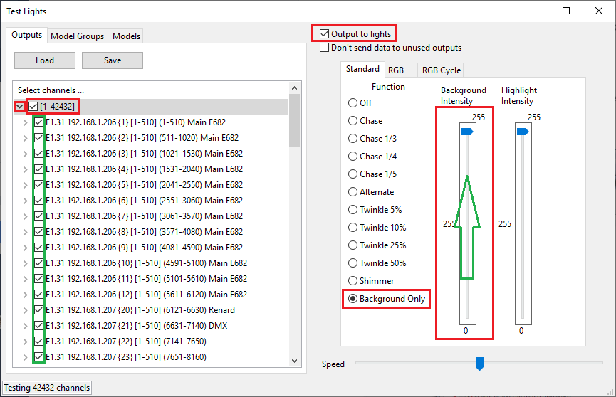

# Testing

## Testing

If you have a set of lights connected to your controller, you can test them directly via xLights. Open the previously saved sequence if it is not already open.

Ensure that the channels and universes configured on your controller match your xLights definition. As an example define 512 channels on Universe 1 and connect a string of lights to that output.

Then select the Test option from the Tools menu.

You will be presented with a screen that shows the controller and all the channels configured via the Setup Tab.

You can select the channels you want to test or in this case select the controller which then selects all channels.

Ensure that ‘Output to Lights’ is selected.

Select the test function \(example Background Only\) and use the sliders to increase the intensity.

To display Model groups or Models instead, click on Model Groups or Models across the top.

Different test functions are available for RGB, non RGB lights as well as the option to execute different test cycles. Set the Tools-&gt;Test section for more information.



