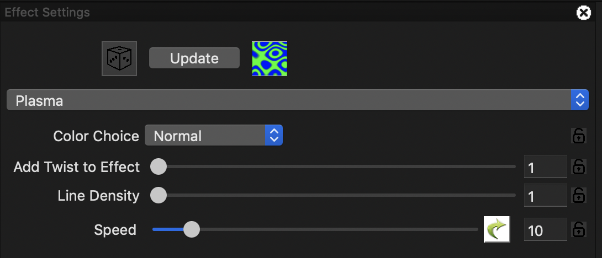

# Plasma

The Plasma effect generates cycles of changing color to give an illusion of a liquid organic movement effect.

<table>
  <thead>
    <tr>
      <th style="text-align:left">Option/Settings</th>
      <th style="text-align:left">Description</th>
    </tr>
  </thead>
  <tbody>
    <tr>
      <td style="text-align:left"><b>Color Choice</b>
      </td>
      <td style="text-align:left">Normal or 4 other preset values. if Normal is selected, then one or more
        colors from the palette can be used to define the colors of the effect.</td>
    </tr>
    <tr>
      <td style="text-align:left"><b>Add Twist to Effect</b>
      </td>
      <td style="text-align:left">Defines how much the components of the movement i.e the ripple, twists.</td>
    </tr>
    <tr>
      <td style="text-align:left"><b>Line Density</b>
      </td>
      <td style="text-align:left">Controls the thickness of each line of the ripples within the effect.</td>
    </tr>
    <tr>
      <td style="text-align:left"><b>Speed</b>
      </td>
      <td style="text-align:left">
        
Controls the rate of change of the ripple movement within the effect.

        
Can be adjusted via the Value Curves options.

      </td>
    </tr>
  </tbody>
</table>