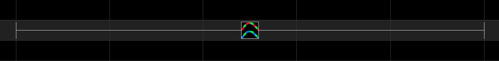

# Single Strand











The Single Strand effect is an effect that is used to implement chases and other such staggered effects on models that are single dimensional in nature such as house outlines, arches as well as AC models.

<table>
  <thead>
    <tr>
      <th style="text-align:left">Option/Settings</th>
      <th style="text-align:left">Description</th>
    </tr>
  </thead>
  <tbody>
    <tr>
      <td style="text-align:left"><b>Chase: Colors</b>
      </td>
      <td style="text-align:left">Defines whether the Rainbow collection of colors is to be used for the
        effect or whether colors are to be selected from the Palette. If Palette
        is selected, then the colors used will be the ones selected via the Color
        window for the effect.</td>
    </tr>
    <tr>
      <td style="text-align:left"><b>Chase:Number of Chases</b>
      </td>
      <td style="text-align:left">
        
Defines the number of chases.

        
Can be adjusted via the Value Curves options.

      </td>
    </tr>
    <tr>
      <td style="text-align:left"><b>Chase: Chase Size</b>
      </td>
      <td style="text-align:left">
        
Defines the size of the chase effect as a percentage of the total length
          of the model that will be on during the chase.

        
Can be adjusted via the Value Curves options.

      </td>
    </tr>
    <tr>
      <td style="text-align:left"><b>Chase: Cycles</b>
      </td>
      <td style="text-align:left">
        
Defines the number of cycles of the chase that will execute during the
          timeframe.

        
Can be adjusted via the Value Curves options.

      </td>
    </tr>
    <tr>
      <td style="text-align:left"><b>Chase: Chase Types</b>
      </td>
      <td style="text-align:left">Defines the direction and type of the chase Left-Right, Right-Left, Bounce
        from Left etc.</td>
    </tr>
    <tr>
      <td style="text-align:left"><b>Chase: 3D Fade</b>
      </td>
      <td style="text-align:left">Indicates whether a 3D effect should be applied to the chase.</td>
    </tr>
    <tr>
      <td style="text-align:left"><b>Chase: Group All Arches</b>
      </td>
      <td style="text-align:left">When set, will synchronize the chase effect across multiple elements in
        an Arches model.</td>
    </tr>
    <tr>
      <td style="text-align:left"><b>Skips: Band Size</b>
      </td>
      <td style="text-align:left">Defines the relative size (from one to twenty) of the strand that will
        be on. Used in conjunction with the Skip Size.</td>
    </tr>
    <tr>
      <td style="text-align:left"><b>Skips: Skip Size</b>
      </td>
      <td style="text-align:left">
        
Defines the relative size (from zero to twenty) of the strand that will
          be off. Used in conjunction with the Band Size.

        
Examples:

        
A Band Size of 1 and Skip Size of zero will have the entire effect on.

        
A Band Size of 1 and Skip Size of 1 will have half the effect on and half
          off.

        
A Band Size of 2 and Skip Size of 1 will have half the effect on for two
          units and off for one unit.

      </td>
    </tr>
    <tr>
      <td style="text-align:left"><b>Skips: Starting Position</b>
      </td>
      <td style="text-align:left">Used to define the starting position of the first part of the strand that
        will be on. Advancing this value advances the component of the strand that
        will first turn on.</td>
    </tr>
    <tr>
      <td style="text-align:left"><b>Skips: Number of Advances</b>
      </td>
      <td style="text-align:left">This defines the relative value of the number of units that the effect
        will skip before turning on. A value of zero will force the effect to be
        stationary in one position.</td>
    </tr>
    <tr>
      <td style="text-align:left"><b>Skips: Direction</b>
      </td>
      <td style="text-align:left">Defines the direction of the skip i.e. Left, right, From Middle or To
        Middle.</td>
    </tr>
  </tbody>
</table>